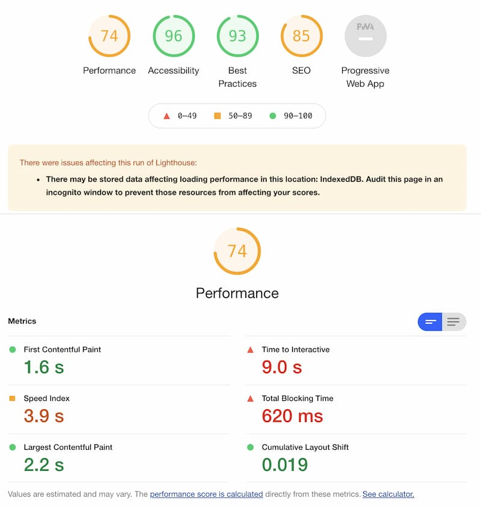
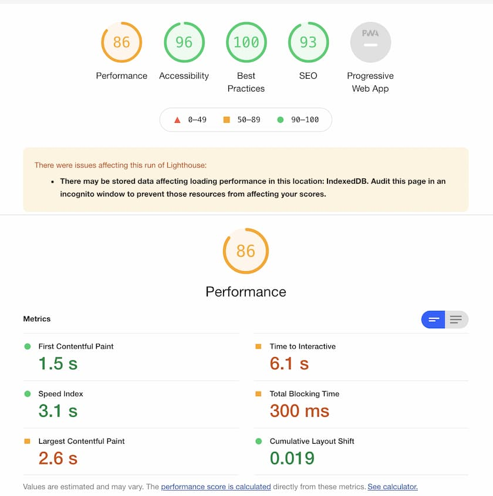

# Issue with performance

When building an ecommerce site or an application where performance is a great deal for the users, you need to keep your application fast and responsive. Frontend developers have already many use-cases when the UI becomes laggy and this increases when 3rd party scripts are being included, such as Google Tag Manager or various Live chats (e.g. Intercom).

This does not only influences the users when using the site but also Lighthouse score gets lower which also influences page rankings. So the most naive and easy way for this is to defer loading of such scripts but when you need to get all the data from the start of the application, such tactic is not an option. So what else can we do?

# Exploring Partytown

Developers at BuilderIO created an library [https://github.com/BuilderIO/partytown](Partytown) that would allow relocating resources from 3rd party scripts off the main thread.
We won't dive into specifics how it works, because they explain it nicely on their GitHub page.

In our stack we use [https://nextjs.org/](Next.js) React framework and we will go through the basic steps that will allow us to include Partytown for Google Tag Manager.

## Setup

Partytown script needs to be located inside our application and live on the same domain. Since we're using monorepo structure, we need to copy this script across all our frontend application. For that we used CopyPlugin webpack plugin in our Next.js config file:

```javascript
config.plugins.push(
      ...
      new CopyPlugin({
        patterns: [
          {
            // we copy script from node_modules partytown package to `~partytown` folder in our package that serves static files
            from: path.join(path.dirname(require.resolve('@builder.io/partytown')), 'lib'),
            // paths for SSR and client side rendering differ
            to: path.join(`${isServer ? '..' : '.'}/static/assets/`, '~partytown'),
          },
        ],
      })
    );
```

Partytown's requirement is that it needs to know what script should it load into own web worker. For that we set script type to `text/partytown`. This will prevent script to load on initial load.

Inside `_document.tsx` we add this:
```javascript
<Head>
    ...
    // include Partytown and set custom path due to multiple frontends
    <Partytown lib={`${addTrailingSlash(this.props.basePath)}_next/static/assets/~partytown/`} debug={false} />
    // tag 3rd party script with partytown type
    <script type="text/partytown" src={`https://www.googletagmanager.com/gtm.js?id=${id}`} />
    ...
</Head>
```

# Results

So now, does it work? We used one of our large Ecommerce sites to test the landing Lighthouse score. 

This was before adding Partytown:



Here you can see 2 critical things: almost 1s of total blocking time (TBT) and 9s of time to interactive (TTI). 

After we added Partytown, we got this:



Time to interactive went from 9s to 6.1s which is almost 33% improvement and total blocking time was reduce by more than 50%! We were more than impressed how easy it was to improve our performances.

Side note: Both screenshots were compressed using [Squoosh App](https://squoosh.app/).

# Next steps

After successful testing of Partytown we are more than interested in trying it out on our other scripts. One important topic will be to test Partytown with other service-worker related libraries and how to use them together.

