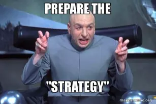

# Why bundle size is important?

## Intro

JavaScript is parsed, compiled and executed in the main thread of the browser. Which means that users have to wait for all of this before they can interact with the website.

Frontend performance optimization is critical because it accounts for around 80-90% of user response time (10-20% backend).
So when a user is waiting for a page to load, around 80-90% of the time is due to frontend related code and assets.

## Nobody likes waiting…

A study found that if a site takes longer than 4 seconds to load, up to 25% of users would abandon the site.

Sending large JavaScript payloads impacts the speed of your site significantly.

## What is a "bundle"?

Your frontend application needs a bunch of JS files to run. These files can be in the format of internal dependency like the JS files you have written yourself. But they can also be external dependencies you use to build your application.

JS bundling is an optimization technique to reduce the number of server requests for JavaScript files. Bundling accomplishes this by merging multiple JA files together into one file to reduce the number of page requests.

## Performance implications

- **Time to transmit over the network**: considering slow connections with some mobile devices, it's possible that your page will not be interactive until it loads.-> More bytes = longer download times
- **JS parse and compile time**: more code you load, more the browser must parse.-> JS gets parsed and compiled on the main thread, when the main thread is busy, the page can't respond to user input
- **JS execution time**: optimally you will only pack the code that you expect to execute. The more code you want to execute the longer it will take. It's possible that your page won't be interactive until some of this completes.-> JS is also executed on the main thread, if your page runs a lot of code before it's really needed, that also delays your Time to Interactive
- **Memory consumption**: everything fills up the space -> code itself, runtime variables, DOM elements created, etc.-> Pages appear slow when it consumes a lot of memory. Memory leaks can cause your page to freeze up completely!!

## What is the recommended bundle size?

AS SMALL AS POSSIBLE! I experienced that is not really possible to give a precise answer because each application is different. Generally you want the resources on initial load to be as small as possible, so that you decrease the initial load time, and then load more resources as needed on the fly.

## What do we do then?

## How to start decreasing the bundle size?

- **Measure**: first of all you want to measure. The first step is to use Lighthouse and try to understand the results. It will give you a couple of interesting metrics and some tips. Time to interactive (TTI) is a good reflection of your bundle size because your bundle needs to be evaluated entirely before a user can interact with your web app.
- **Analyze**: Consists on analyzing the bundle in order to detect critical chunks. A useful tool is Webpack Bundle Analyzer.

## Breaking up the bundle...

- **Monitor network requests**: These happens between our FCP and TTI. As the initial request for data often occurs when our components initially mount.
- **Reduce the total dom nodes**: the less the page needs to render, the less time it takes.
- **Moving work off the main thread**: By moving heavy computations to a web worker, the computation will be run on a separate thread, and not block the actual rendering of the page
- **Caching**: Even if not useful for users on first page landing, caching data, bundles, and assets can make subsequent visits way fast

## Which strategies can we adopt?

- **Minification and Dead Code Elimination**: These processes are often summed up as minifying or uglifying.
- **Tree shaking**: Tree shaking is dead code elimination on a project or library. Always try to use deps which support “tree shaking”, Bundlephobia could be your friend in this case.
- **Code Splitting and Lazy Loading**: Code splitting consists on taking a collection of modules and remove them from the main JS bundle. Lazy loading means we can load this newly created bundle later on.
- **Replace/rewrite large dependencies**: Consider replacing or rewriting libraries that are large in size where you might not need all of its functionalities (Moment.js for example).
- **Feature module import**: Check to see if you are using only a feature module of the library that can be imported alone without importing the whole library (Lodash for example).

## Useful tools to help you reducing bundle size

- **Lighthouse**: automated tool for improving the performance, quality, and correctness of your web apps
- **Bundlephobia**: Bundlephobia helps you find the performance impact of npm packages
- **Webpack Bundle Analyzer**: analyzes your bundle
- **VS Code**: Import Cost plugin -> Display import/require package size in the editor

## Conclusion

Performance cannot be stripped down to a single metric such as bundle size. It would be great!
Unfortunately there is no single place to measure all of them.I think metrics like the Core Web Vitals and a general look at bundle size should be considered as a starting point.
You will cry... A lot... But don’t give up!

