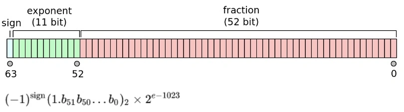

# Accuracy of decimal computations

## Intro

Calculating with money can be tricky if not taken proper precautions. Some might be tempted to use float representation for calculating with currency values. That is problematic because of possible rounding errors.

## Finite accuracy of representation

Floating points are represented like this



Not every number can be represented with a finite number of decimal places

0.01 —> 0.0000011001100110011…

Taking 17 places of the above results in 0.010000000000000001

Consider the following code snipet that shows the missing accuracy

```go
func main() {

  var n float64 = 0

  for i := 0; i < 1000; i++ {
    n += .01
  }

  fmt.Println(n)

}
```

Result: 9.999999999999831

## Money computations

They can't be done with floating-point as it would inevitably lead to rounding errors.

Even the following packages are problematic:

[github.com/shopspring/decimal](https://github.com/shopspring/decimal)

[github.com/Rhymond/go-money](https://github.com/Rhymond/go-money)

```go
a := decimal.NewFromInt(2)
b := decimal.NewFromFloat(300.99)
c := a.Mul(b)
d := c.Div(decimal.NewFromInt(3))
```

## Solution

Use Int by representing money in cents:

- 10.99 -> 1099 (cents)
- 10.9900 -> 109900 (4 digit tax)

## Conclusion

**Division is a problem!**

1/3 - > 0.33333333…
Correct way: 0.33, 0.33, 0.34

When doing money calculations one should avoid division as it inevitably leads to loss of accuracy.
When dividing make sure to round to cent and deal with diffs.

Division by 10^k is ok as long as we are inside of the range of the data type.
