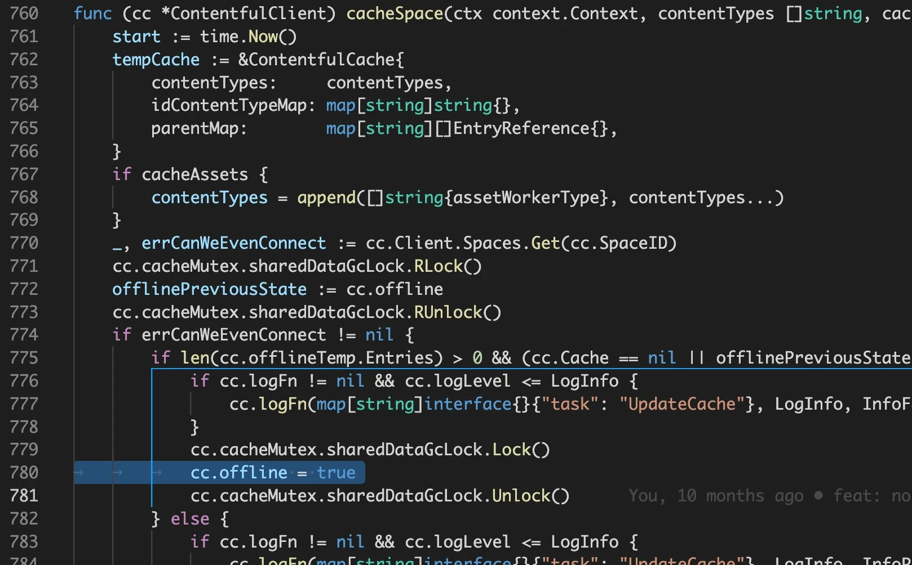

# Go race conditions testing and coverage

Go has extensive support for concurrency through goroutines and channels. This feature allows programs to progress on several tasks at the same time but it requires some extra care to prevent situations where multiple goroutines might collide and lead to a panic. These are known as race conditions and they happen when a shared variable is read and written at the same time by two different routines. A typical example is a concurrent read/write of a map in memory.

To illustrate an example let's consider [gocontentful](https://github.com/foomo/gocontentful), the code generator that creates an API to access a Contentful CMS from go. The generated API uses an in-memory cache to store a copy of a Contentful space and some extra data structures to allow go programs to access Contentful data, inspect and resolve references and so on. In a typical scenario, the client is used in a service that responds to HTTP calls and makes heavy use of concurrency because it needs to be able, at the same time, to:

- Read entries, assets and references from the cache
- Update/Delete single entities and their connections with others (for example the map of parent entries)
- Incrementally sync the content of the cache with data changes coming from Contentful
- Rebuild the cache entirely and swap the existing one with a new copy

In addition, for performance reasons, when the cache is created or rebuilt the gocontentful client spawns up to four goroutines to download chunks of data in parallel across the Internet, dynamically selecting the size the sorting of the chunks to leverage the maximum parallelism.

## Detecting race conditions through unit tests

We experienced race conditions with the client in the past, and we fixed them to maintain it production-ready with every new version. To help with this, we included a testing framework in gocontentful that generates a sample API from a local export of a Contentful space and then runs several unit tests that, among others, test the client for concurrency safety:


One of these unit tests spawns tens of thousands of goroutines to concurrently read, write and inspect the references of specific entries while at the same time keeps rebuilding the cache. From the screenshot above we see that no race condition is shown. Even at this concurrency level, though there's no guarantee that running

```bash
go test ./...
```

will be enough to generate a collision. What we really want to do is to add a new parameter to enable the go race detector with

```bash
go test -race ./...
```

(In gocontentful you can run _make race_ to fire up both the API generation and the race test)

From the documentation at https://go.dev/blog/race-detector:

> _When the -race command-line flag is set, the compiler instruments all memory accesses with code that records when and how the memory was accessed, while the runtime library watches for unsynchronized accesses to shared variables. When such “racy” behavior is detected, a warning is printed._

Running this in gocontentful shows that we indeed have a potential collision condition:


_Note: After you run this test you'll want to search for "race" inside the terminal output. Make sure you enable a very long (if not infinite) scrollback or you might miss some hits._

The race detector reports the filenames and lines of code that generated the race condition. Looking at those lines in our example shows that a field of the cache (the "offline" boolean) is written protecting it with a proper mutex lock but the lock handling is missing around the read operation:




The fix is very simple but in this particular case the offline flag is read and then a 2 seconds delay is started. Deferring the unlock would keep the variable locked for far too long, so we will read-lock it only for the time needed to copy its value to a local variable:


After fixing the issue in the generator templates and regenerating the code, the tests with the race detector run fine. In gocontentful this can be done all in one step with make race:


## Test coverage

That was nice! But how do we know if we're covering all test cases? Go has been supporting test code coverage since 1.12 through the -cover option. We can also limit the coverage to a specific package. In our case, we're only interested in the _testapi_ sub-package because we want to test the generated API, not the generator itself.

```bash
go test -cover -coverpkg=./test/testapi ./...
```

Let's try and run the tests with coverage:


The summary shows we are only covering 22% of the code. The goal is not to cover 100%, some parts only work online calling the actual API of a real Contentful space, but we definitely have room for improvement.

The question is: how do we know exactly which lines of code we're covering through the test suite? Again, go test comes to the rescue through another option: _-coverprofile_ lets us specify an output file that will contain references to each single line of code involved in the analysis. It is a text file, but not very readable:

```
github.com/foom...tapi/gocontentfulvolibproduct.go:21.86,22.15 1 1
github.com/foom...tapi/gocontentfulvolibproduct.go:25.2,25.18 1 1
github.com/foom...tapi/gocontentfulvolibproduct.go:28.2,29.16 2 0
github.com/foom...tapi/gocontentfulvolibproduct.go:32.2,33.16 2 0
github.com/foom...tapi/gocontentfulvolibproduct.go:36.2,37.37 2 0
github.com/foom...tapi/gocontentfulvolibproduct.go:40.2,40.24 1 0
github.com/foom...tapi/gocontentfulvolibproduct.go:22.15,24.3 1 0
github.com/foom...tapi/gocontentfulvolibproduct.go:25.18,27.3 1 1
github.com/foom...tapi/gocontentfulvolibproduct.go:29.16,31.3 1 0
github.com/foom...tapi/gocontentfulvolibproduct.go:33.16,35.3 1 0
github.com/foom...tapi/gocontentfulvolibproduct.go:37.37,39.3 1 0
github.com/foom...tapi/gocontentfulvolibproduct.go:43.114,44.35 1 0
github.com/foom...tapi/gocontentfulvolibproduct.go:47.2,48.18 2 0
github.com/foom...tapi/gocontentfulvolibproduct.go:51.2,53.16 3 0
github.com/foom...tapi/gocontentfulvolibproduct.go:56.2,57.16 2 0
...
```

We can use _go tool_ to convert it to a much better representation in HTML:

```bash
go tool cover -html=cover.out -o cover.html
```

Opening this file in a browser reveals a lot of useful information:


At the top left of the page there's a menu where we can select from all the files analyzed, listed along with the percentage of coverage for each one. Inside every file the lines covered by the tests are green while the red ones are not covered. In the example above we can see that the getAllAssets function is covered but it includes an _else_ condition that is never met.

In gocontentful (starting from 1.0.18) we can generate the test API, run the tests with coverage, convert the output file and open it in the browser with a single command:

```bash
make cover
```

As stated above, not necessarily 100% of the code needs to be covered by the tests, but this view in combination with the race detector gives us incredibly useful information to make the code more solid.
