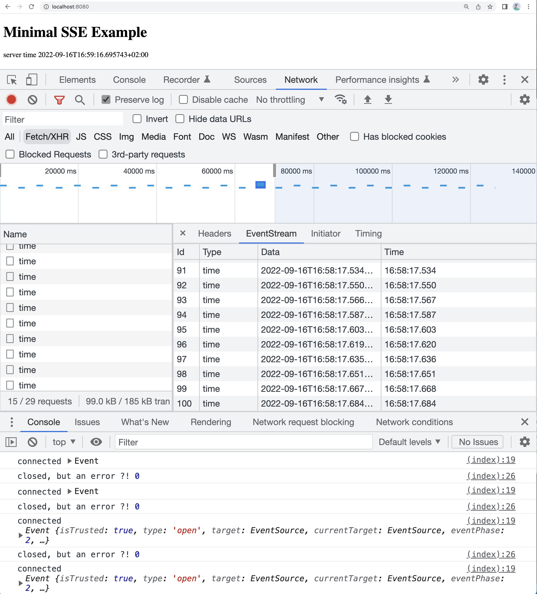

# SSE Server Sent Events

Server Sent Events [SSE](https://html.spec.whatwg.org/multipage/server-sent-events.html) are a well established web standard.

They allow a web server to push messages to the client. 

I have created a minimal example https://github.com/janhalfar/sse-playground/tree/main/minimal to illustrate the technology.

## Minimal Example in action

if you clone https://github.com/janhalfar/sse-playground locally and run <nobr>`go run minimal/main.go`</nobr> you will be able to open http://localhost:8080 :



## Minimal server

This server will:

- serve its minimal frontend on [http://localhost:8080](http://localhost:8080)
- serve a time event 100 times on [http://localhost/sse/time](http://localhost/sse/time)

Let´s take a look at the server response with:

`curl -v localhost:8080/sse/time`

```zsh
% curl -v localhost:8080/sse/time
*   Trying 127.0.0.1:8080...
* Connected to localhost (127.0.0.1) port 8080 (#0)
> GET /sse/time HTTP/1.1
> Host: localhost:8080
> User-Agent: curl/7.79.1
> Accept: */*
>
* Mark bundle as not supporting multiuse
< HTTP/1.1 200 OK
< Content-Type: text/event-stream
< Date: Fri, 16 Sep 2022 14:49:17 GMT
< Transfer-Encoding: chunked
<
event: time
id: 1
data: 2022-09-16T16:49:17.482796+02:00

event: time
id: 2
data: 2022-09-16T16:49:17.498366+02:00

event: time
id: 3
data: 2022-09-16T16:49:17.514079+02:00

event: time
id: 4
data: 2022-09-16T16:49:17.529639+02:00

event: time
id: 5
data: 2022-09-16T16:49:17.545335+02:00

...
```

### serving the frontend

The first thing the server is to serve a frontend, which is described below:

```go reference title="serve the embedded index.html"
https://github.com/janhalfar/sse-playground/blob/main/minimal/main.go#L16-L18
```

### serving time events

```go reference title="serve an event stream of 100 server sent events"
https://github.com/janhalfar/sse-playground/blob/main/minimal/main.go#L20-L43
```


## Minimal client

```javascript reference title="a minimal and incomplete client example"
https://github.com/janhalfar/sse-playground/blob/main/minimal/index.html#L11-L30
```


