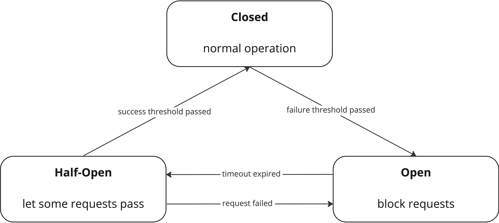

# Circuit Breaker

Sometimes things go wrong and a service does not respond anymore. Be it because of maintainance or because the whole data center burned to the ground. In such a scenario, you might not want to wait until your request times out. This is where circuit breakers come in handy.

Simply put a circuit breaker has three different states:



We did not re-invent the wheel (yet), but rather used an existing circuit breaker. However, we extended the functionality a bit. More on that later. For referance, here are links to the [underlying circuit breaker](https://github.com/sony/gobreaker) and some more [information on circuit breakers in general](https://learn.microsoft.com/en-us/previous-versions/msp-n-p/dn589784(v=pandp.10)?redirectedfrom=MSDN).

## How to use
In order to configure the circuit breaker there are two kinds of configuration. The "base" configuration using the `CircuitBreakerSettings` and optional configuration using `CircuitBreakerOptions`.

### CircuitBreakerSettings
The settings are relatively straight forward and the same as with the underlying repository - with one exception. Our settings are missing the `IsSuccessful` field.

```go reference 
https://github.com/foomo/keel/blob/b14b59b0c4ff880827f102c08c43b1de2989367f/net/http/roundtripware/circuitbreaker.go#L27-L49
```

### CircuitBreakerOptions

Currently, there are two options one for metrics and one for somewhat advanced usage.

#### Metrics

The option for metrics is, again, straigth forward. When the `CircuitBreakerWithMetric` option is used the roundtripware will create a counter on the provided meter and count the number of requests.

The attributes added to every count are:
- `previous_state` (String): the state of the circuit breaker **before** the current request. Either "closed", "half-open" or "open"
- `current_state` (String): the state of the circuit breaker **after** the current request. Either "closed", "half-open" or "open"
- `state_change` (Bool): helper containing `current_state` != `previous_state`
- `error` (Bool): false if the request was not passed through or was unsuccessful


```go reference 
https://github.com/foomo/keel/blob/b14b59b0c4ff880827f102c08c43b1de2989367f/net/http/roundtripware/circuitbreaker.go#L74-L78
```

#### IsSuccessful
As mentioned previously, the IsSuccessful field was removed from the basic settings. The reason is that the signature of that function was a bit limiting. As you can see below our `IsSuccessful`-function can use the request and response. Additionally, if `copyReqBody` and/or `copyRespBody` are set to true, you can even read from the respective body, without worrying about consuming the io.ReadCloser.

```go reference 
https://github.com/foomo/keel/blob/b14b59b0c4ff880827f102c08c43b1de2989367f/net/http/roundtripware/circuitbreaker.go#L93-L97
```

The ignore value that is returned alongside an error indicates whether the result of the call should be registered with the circuit breaker. For most use cases it should be set to false.

When the `IsSuccessful`-function returns an error (and the ignore value is set to false), the request will be counted as unsuccessful. Accordingly, a nil error paired with ignored set to false indicates a successful request.

### Examples
Let's say we want to stop sending requests once we encountered three consecutive failures.

``` go
client := keelhttp.NewHTTPClient(
		keelhttp.HTTPClientWithRoundTripware(l,
			roundtripware.CircuitBreaker(&roundtripware.CircuitBreakerSettings{
				Name:        "my little circuit breaker™",
                // 2 requests can pass in half-open state & it takes 2 consecutive,
                // successful requests to change to closed state
				MaxRequests: 2,
                // counts are not reset in closed state
				Interval:    0, 
                // breaker will go from open to half-open state after 30s
				Timeout:     30 * time.Second,
                // go to open state after the 3rd consecutive, unsuccessful request
				ReadyToTrip: func(counts gobreaker.Counts) bool {
					return counts.ConsecutiveFailures >= 3
				},
			}),
		),
	)
```

Now lets say we see we also want to detect network problems such as a BadGateway. For this we can use the `IsSuccessful` option.

``` go
client := keelhttp.NewHTTPClient(
    keelhttp.HTTPClientWithRoundTripware(l,
        roundtripware.CircuitBreaker(&roundtripware.CircuitBreakerSettings{
            // as before ...
        },
            roundtripware.CircuitBreakerWithIsSuccessful(
                func(err error, req *http.Request, resp *http.Response) (error, bool) {
                    if err != nil {
                        return err, false
                    }
                    if resp.StatusCode >= http.StatusInternalServerError {
                        return errors.New("invalid status code"), false
                    }
                    return nil, false
                }, false, false,
            ),
        ),
    ),
)
```

Lastly, let's assume we use the client for multiple different endpoints. And we only want to base the circuit breakers state on a single endpoint, but stop request on all endpoints once the breaker changes to open. Again we can use the IsSuccessful option and ignore certain endpoints.

``` go
client := keelhttp.NewHTTPClient(
    keelhttp.HTTPClientWithRoundTripware(l,
        roundtripware.CircuitBreaker(&roundtripware.CircuitBreakerSettings{
            // as before ...
        },
            roundtripware.CircuitBreakerWithIsSuccessful(
                func(err error, req *http.Request, resp *http.Response) (error, bool) {
                    if req.URL.Path != "/important/path" {
                        return err, false
                    }

                    // possibly more checks ...

                    return err, true
                }, false, false,
            ),
        ),
    ),
)
```

### General advice & notes of caution
#### Using ratios in ReadyToTrip
When using ratios in ready to trip, the `Interval` should be set to a non-zero value in order to reset the counts periodically. Otherwise, after a long period of successful requests it will also take a long time to impact the ratio and trip the breaker.

``` go
    ReadyToTrip: func(counts gobreaker.Counts) bool {
        failureRatio := float64(counts.TotalFailures) / float64(counts.Requests)
        return counts.Requests >= 3 && failureRatio >= 0.6
    },
```


